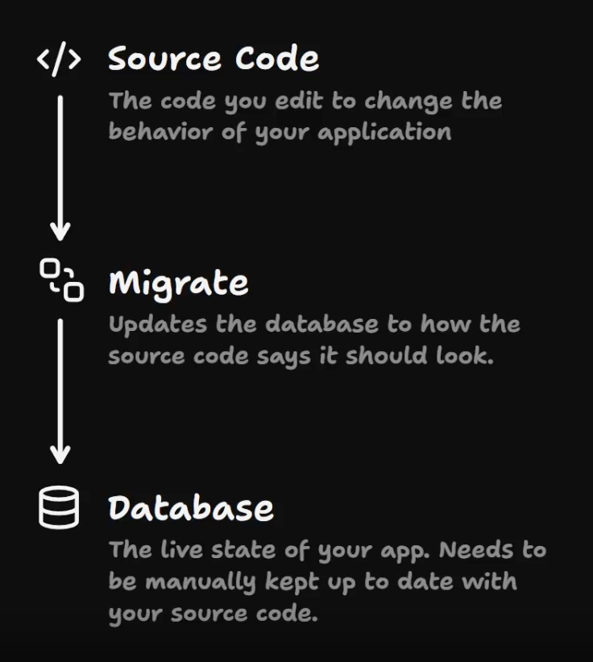
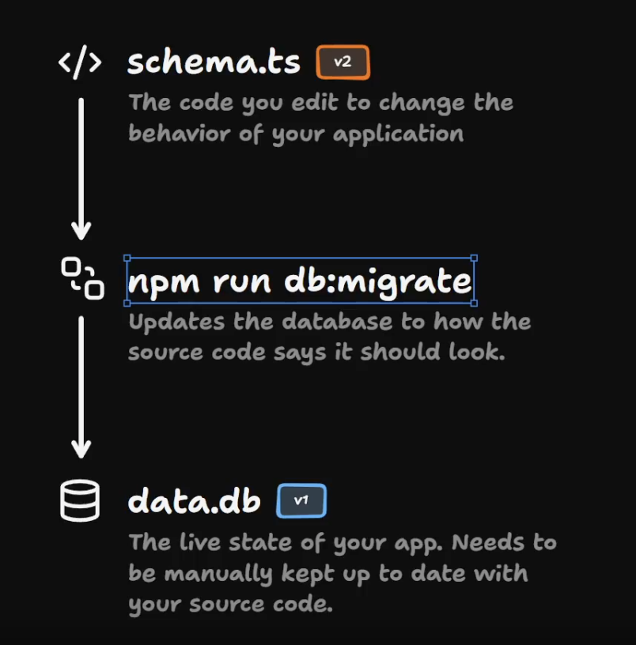
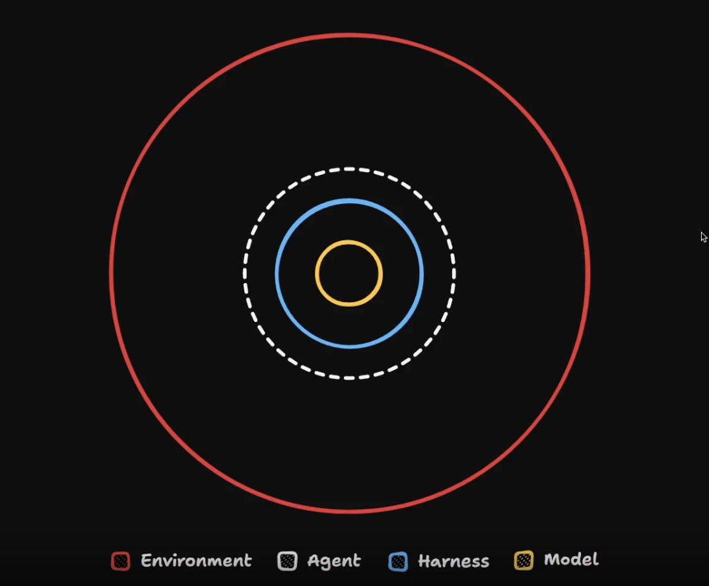

# AI Coding Crash Course — My Notes

**Course:** [AI Coding Crash Course](https://www.aihero.dev/workshops/ai-coding-crash-course) by Matt Pocock (AI Hero)
**Started:** 2026-08-25
**Repo:** `ai-coding-crash-course` — mini-Udemy-style course platform (React Router v8, TypeScript, SQLite/Drizzle, Tailwind + shadcn/ui, Vitest) used as the hands-on exercise codebase.

Personal scratchpad for notes, gotchas, and things worth remembering as I go through the course.

---

## Some concepts we will cover

- smart zone / dumb zone - learn to recognize when agent is going dumb and how to keep it in smart zone
- managing context
- compaction vs. handoff - 3 ways to continue past a full context
- grilling
- codebase exploration
- AGENTS.md
- skills
- progressive disclosure
- crystal clear requirements
- decompressing complex work into session-sized chunks
- handoffs - leaving breadcrumbs for an agent so we can both pick up on where we left later
- subagents - how to delegate exploration and other tasks
- ...

---

## Notes

<!-- Add lesson notes, insights, and questions below as you go. -->
Writing `/model` gives you a list of available models:
- up/down arrows change model
- left/right can change effort
- control+Shift+G (jump to git message)

## Before we start

### Project commands

- npm run reset (reset to a certain lesson)
- npm run cherry-pick (resets to a certain lesson but keeps your custom changes)
- npm run pull (pull latest course updates)

### Database migrations

Migrate === Updates the database to how the source code says it should look

npm run db:migrate

### Reseting to a clean slate

Before the course we will reset all our Claude settings and back it up.

I didn't do a full cleaning of my existing projects (think of doing that after the end of the course).

[IMPORTANT] Restore command: "restore my Claude Code config 
  from ~/agent-config-backup-2026-08-26"

### Installing the Request logger

In one terminal just run this: npm run request-logger

And in another one just paste what logger suggested.
Example: `ANTHROPIC_BASE_URL=http://localhost:8787 ENABLE_TOOL_SEARCH=true claude`

This will be generating log files in `request-logger/logs` - we will be checking these in more detail later in this course.

---

## Concepts

### Models, Harnesses, Agents, Environments

**An Agent is a model, harnessed in an environment.**

Examples: 

- *Opus 4.8, on Claude Code, on the filesystem*
- *GPT 5.5, on ChatGPT, in the ChatGPT environment*

### Turns and Model Provider Requests

Used the request logger (`npm run request-logger`) to see the actual traffic between the harness (Claude Code, local) and the model provider (Anthropic, in the cloud). Logs land in `request-logger/logs`, one file per request.

- **Model provider request** = one round trip: request out, response back. Handled by a **model provider** (Anthropic, Ollama, etc).
- Each log file shows: meta/headers, the full **system prompt**, tool definitions (JSON schema), the conversation so far, and the response.
- A simple "hello" already sends a huge system prompt + tool definitions for a one-line reply.
- **The full conversation history is resent on every request** — previous messages, previous responses, all accumulated context. Nothing is summarized under the hood by the model; this is why logs (and cost) grow as a conversation goes on.
- Asking for something simple (e.g. "tell me my hair looks nice") can trigger *multiple* hidden requests, not just one — e.g. background suggestion requests (`SuggestionMode`) that generate what you might type next. Every AI-generated bit of UI = a model provider request happening somewhere.
- **Tool call** = the model's instruction to use a tool (e.g. `write` with `file_path` + `content` params) — this is not execution, just a request.
- **Tool result** = the output of the harness actually running that tool (e.g. writing the file to disk). The model never touches the filesystem directly; the harness executes tool calls and reports results back to the model in the next request.
- **Turn** = the entire cycle from a user message to the agent's final answer, including every model provider request, tool call, and tool result along the way. A single turn can contain hundreds of model provider requests and last hours.

| Element | Definition |
|---|---|
| Model Provider Request | One round trip to the model (request + response) |
| Tool Call | The model's instruction to use a tool (not the execution) |
| Tool Result | The output of executing that tool |
| Turn | The entire cycle from user message to agent response, including all tool calls and results |

### Sessions and the Context

**Context** = all the available information the agent has access to at request time (instructions, parameters, scope, tool calls, conversation so far). It gets turned into tokens, and the model does next-token prediction on top of it to produce its response.

- **Context window** = the max tokens a model can receive in a single request. It's an arbitrary number picked by the model's developers based on what their infra can handle (e.g. GPT 5.6 Sol: 1.1M tokens, Gemini 3 Pro: 1M tokens, GPT 5.2 Chat Latest: 128k tokens).
- Go over the context window and **the request just fails** — no output tokens at all. Nothing gets silently trimmed/dropped for you.
- You're billed for every token sent, every request, so keep context relevant — irrelevant text costs money AND can distract/confuse the model, same as it would a human.
- **The context window never starts at zero when using a harness.** The harness (agentic framework/wrapper) injects a **system prompt** right from the start: what tools are available, high-level instructions, what role the agent should inhabit. Different harnesses send very different amounts of this text.
- **Session** = a continuous conversation with an agent where context builds up over multiple turns (turn 1: 5 model provider requests, turn 2: 3 requests, turn 3: 4 requests... all part of the same session, each new request carrying the full history so far).
- Having the word "session" matters because it's the unit you act on: you can **clear** it (start fresh), **compact** it (shrink but keep going), or set it aside and come back later.

| Term | Definition |
|---|---|
| Context | All the available information the agent has access to, including instructions, parameters, scope, and tool calls |
| Context Window | The maximum amount of context (in tokens) that a model can receive in a single request |
| System Prompt | The initial instructions given to the agent by the harness, defining its role and behavior |
| Session | A continuous conversation with an agent, where context builds up over multiple turns |

### Smart Zone / Dumb Zone

A typical agent turn uses ~18k tokens, but models advertise context windows up to 1M — so why not just use all of it? Because the model doesn't reason over that text for free: every token added has to be related to every other token already in context (an **attention relationship**), and that count scales quadratically, not linearly.

- 2 tokens → 1 relationship, 3 tokens → 3, 4 → 6, 5 → 10.
- At scale: 1,000 tokens ≈ 1 million relationships, 10,000 tokens ≈ 100 million, 100,000 tokens ≈ 10 billion.
- The more relationships the model has to track, the worse its **attention** performs — this is **attention degradation**. It's the underlying mechanism and doesn't go away as models improve; only the thresholds shift.

This produces two zones within a single context window:

- **Smart zone** (early in the context window) — agent handles planning, complex builds, strategic decisions well.
- **Dumb zone** (context filled up) — agent still "works" but gets sloppy even on simple stuff (basic file writes, closing issues, writing specs). Also costs more per request since you're sending huge amounts of tokens each time.

- Current (debated, moves with model quality) consensus: dumb zone starts around **150k tokens** — up from ~100–120k in earlier course versions. Expect this number to keep climbing as models improve.
- The 1M-token advertised window ≠ usable smart-zone size. It exists because (a) it's a good headline, and (b) some use cases (pure retrieval over long text) don't need peak reasoning. Coding work does need the smart zone.
- **It's a slope, not a cliff** — quality degrades gradually as context fills, not suddenly at 150k. Treat ~150k tokens in a session as the signal to start planning a bail-out: hand off the work, compact, or otherwise get back into a fresh smart zone rather than grinding on inside the dumb zone.

### Statelessness

The **model** itself is completely stateless — it processes a single request based only on the context it's handed, and retains nothing between requests. All the "memory" of a conversation actually lives one level up.

| Concept | Stateful? | Scope | Responsibility |
|---|---|---|---|
| Model | Stateless | N/A | Processes a single request based on provided context |
| Harness | Stateful | Within one session | Remembers all messages and session history |
| Environment | Stateful | Indefinite | Persists files, changes, and data on disk |

- The **harness** carries the session's message history forward across turns, resending it all each request — but only for the life of that session. **Clear** the session and the harness forgets everything.
- The **environment** (filesystem, etc.) is the only thing that's *always* stateful — save a file, then clear the session, and the file is still there.
- People who want the agent to "remember stuff about them" over time are really asking for state in a stateless system — that's what memory systems bolt on. But the simpler, usually-sufficient answer is: **save it in the environment** (i.e. the codebase) rather than reaching for a separate memory system. Quoting Mario Zechner (creator of Pi): *"my codebase is my memory system."*
- Default to statelessness where you can — it's simpler and tends to work better than bolting memory onto the agent itself.

